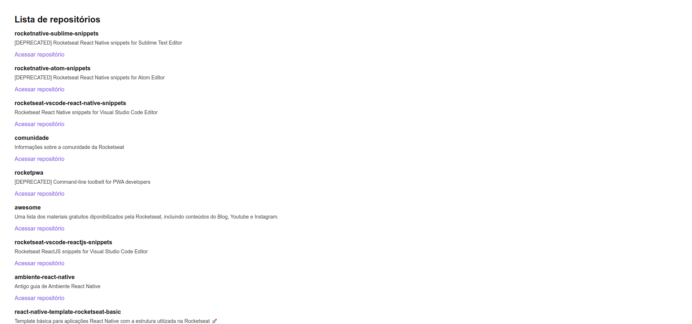

<p align="center">
   
</p>

<p align="center"><em>Github Explorer is the first project developed in chapter 1 of <a href="https://github.com/Rocketseat" target="_blank">Rocketseat's</a> Ignite ReactJS track. The project shows a basic build from scratch to a project developed in ReactJs. The project lists the Rocketseat repositories using the Github API.</em></p>



## :rocket: Techs

<ul>
  <li> HTML</li>
  <li> SCSS </li>
  <li> JavaScript </li>
  <li> React </li>
  <li> TypeScript </li>
  <li> Babel </li>
  <li> Webpack </li>
</ul>

## Development

---

### Prerequisites

- Install [Node.js](https://nodejs.org)

- Install [Yarn](https://yarnpkg.com/)

### Clone the repo

```bash
$ git clone git@github.com:vitorgaletti/rocketseat-ignite-reactjs.git
```

### Run project

```bash
# Change into directory
$ cd fundamentos-do-reactjs/
$ cd 01-github-explorer/
```

- Install dependencies

```bash
$ yarn
```

- Run

```bash
$ yarn dev
```

- Run scripts

|        Action        |    Usage     |
| :------------------: | :----------: |
|  Start development   |  `yarn dev`  |
| Build for production | `yarn build` |
