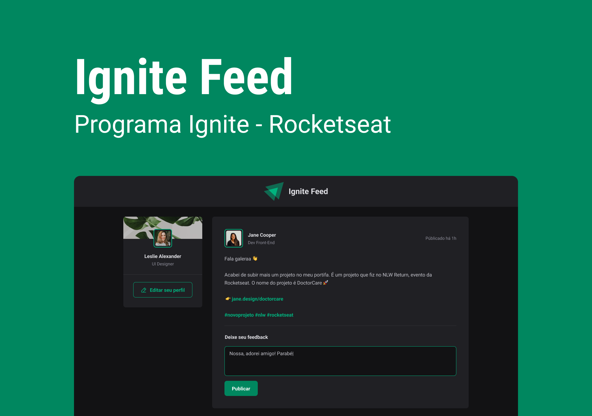
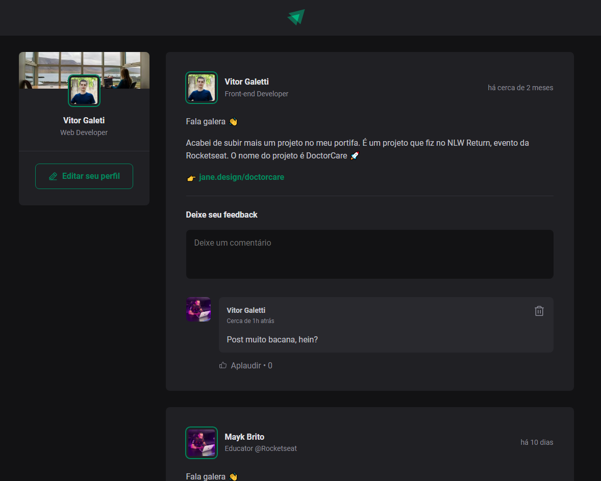
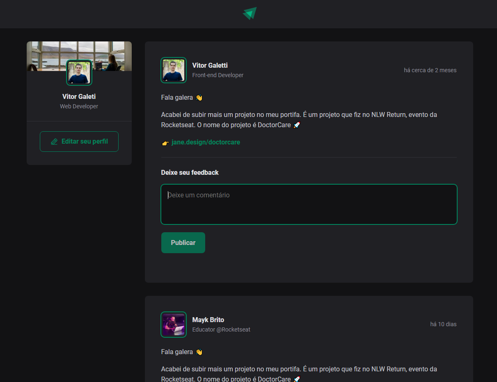

# Ignite Feed

<p align="center">
  
  
</p>

<br>

<p align="center"><em>Confira o resultado do desafio em: <a href="https://ignite-feed-vitor.vercel.app" target="_blank">ignite-feed-vitor.vercel.app</a></em></p>

## :computer: Sobre o projeto

<hr>

Ignite Feed é uma aplicação web onde podemos comentar nas postagens e interagir com os comentários, como dar likes. Também é possível deletar os comentários se preferir.

## Imagens

<div>
   
   
</div>

## :rocket: Techs

<ul>
  <li> ReactJS </li>
  <li> TypeScript </li>
  <li> date-fns </li>
  <li> phosphor-react </li>
  <li> Vite </li>
</ul>

## Desenvolvimento

---

### Pré-requisitos

- Instalar [Node.js](https://nodejs.org)

### Clone o repositório

```bash
$ git clone https://github.com/vitorgaletti/rocketseat-ignite-reactjs.git
```

### Executar Projeto

```bash
# Mudar para directório
$ cd rocketseat-ignite-reactjs/
```

```bash
# Mudar para directório
$ cd 01-fundamentos-do-reactjs/
```

```bash
# Mudar para directório
$ cd 01-ignite-feed/
```

- Instalar dependências

```bash
$ npm install
```

- Execute

```bash
$ npm run dev
```

```bash
$ npm run build
```

- Executar scripts

|          Ação          |   Utilização    |
| :--------------------: | :-------------: |
|   Iniciar o servidor   |  `npm run dev`  |
| Compilar para produção | `npm run build` |

Acesse <http://localhost:3000> para ver o resultado.
