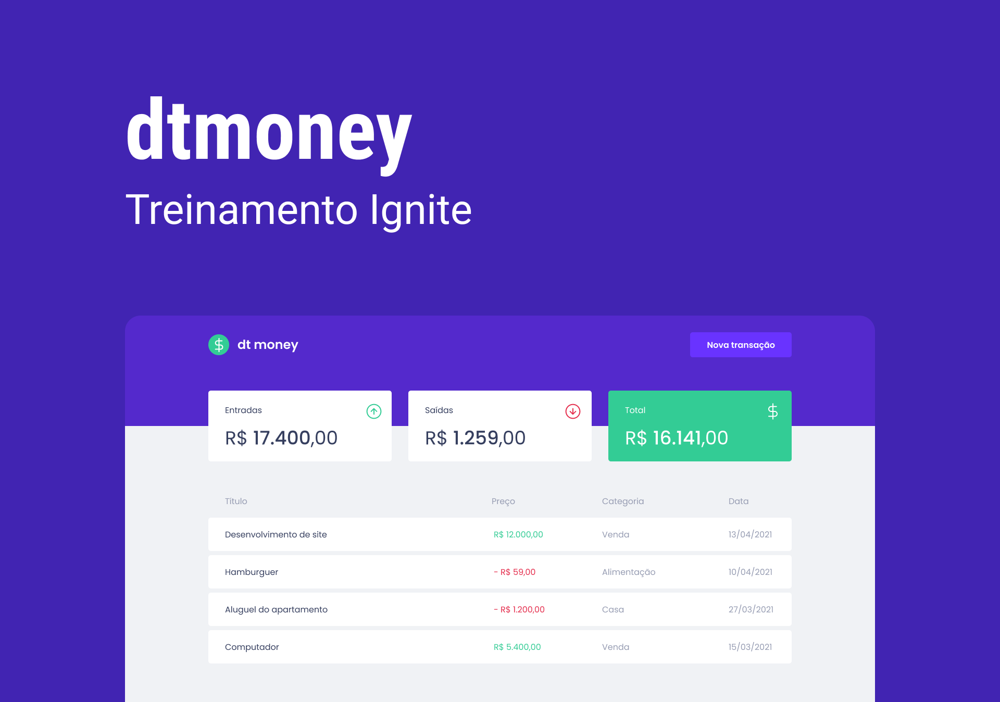
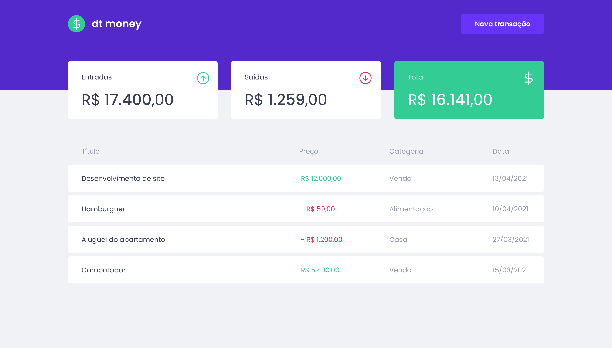
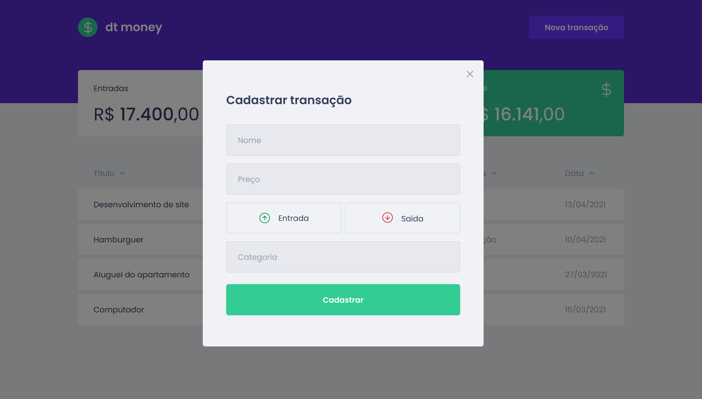
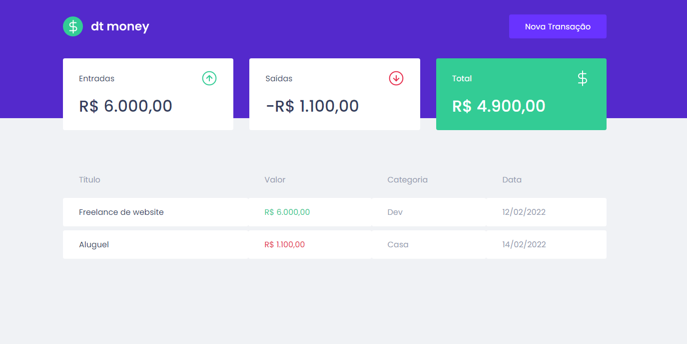
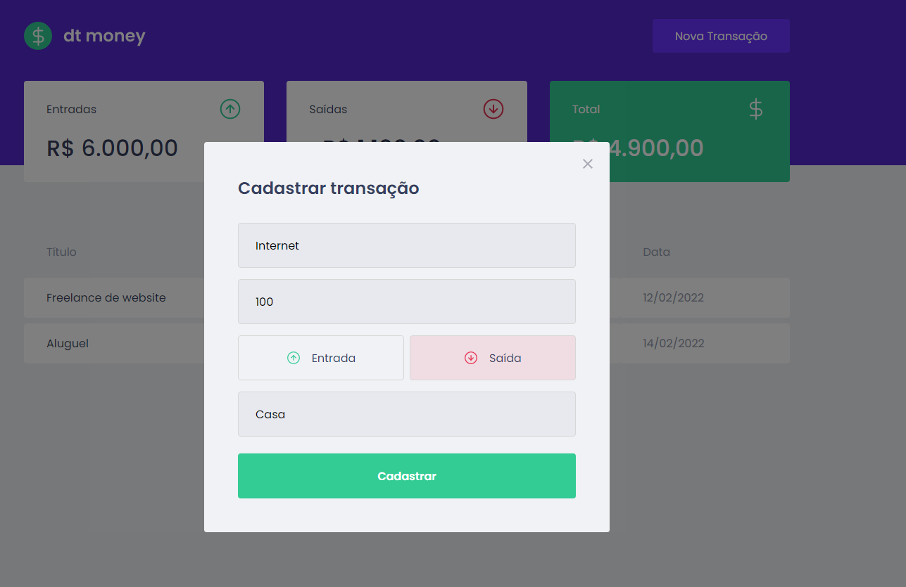

# Chapter II - Primeira aplicação Web com ReactJS

<p align="center">
  
  
</p>

<br>

<p align="center">

</p>

<br>

<p align="center"><em>Confira o resultado do desafio em: <a href="https://dtmoney-rocketseat-vitor.vercel.app/" target="_blank">dtmoney-rocketseat-vitor.vercel.app</a></em></p>

## :computer: Sobre o projeto

<hr>

O dt money é uma alternativa simples e eficaz para gerenciar suas finanças, permitindo o cadastro de entradas, saídas e a organização das mesmas em categorias. Foi desenvolvida durante as aulas do Chapter II da trilha de ReactJS do Bootcamp Ignite da Rocketseat, e nela é possível cadastrar e excluir transações e ver o saldo de entrada e saída 💰

## Layout da Aplicação

|                         Dashboard                         |
| :-------------------------------------------------------: |
|  |

<br>

|                          Cadastrar transação                          |
| :-------------------------------------------------------------------: |
|  |

<br>

## Imagens

<div>
   
   
</div>

## :rocket: Techs

<ul>
  <li> ReactJS </li>
  <li> TypeScript </li>
  <li> Styled-Components </li>
  <li> Axios </li>
  <li> Mirage JS </li>
</ul>

## Desenvolvimento

---

### Pré-requisitos

- Instalar [Node.js](https://nodejs.org)

- Instalar [Yarn](https://yarnpkg.com/)

### Clone o repositório

```bash
$ git@github.com:vitorgaletti/rocketseat-ignite-reactjs.git
```

### Executar Projeto

```bash
# Mudar para directório
$ cd dtmoney/
```

- Instalar dependências

```bash
$ yarn
```

- Execute

```bash
$ yarn start
```

```bash
$ yarn build
```

- Executar scripts

|          Ação          |  Utilização  |
| :--------------------: | :----------: |
|   Iniciar o servidor   | `yarn start` |
| Compilar para produção | `yarn build` |

Acesse <http://localhost:3000> para ver o resultado.
