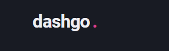
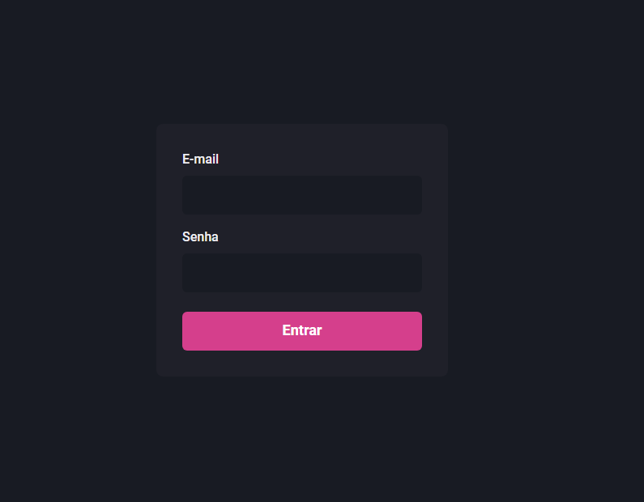
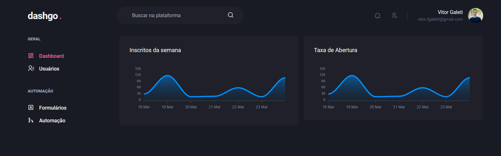
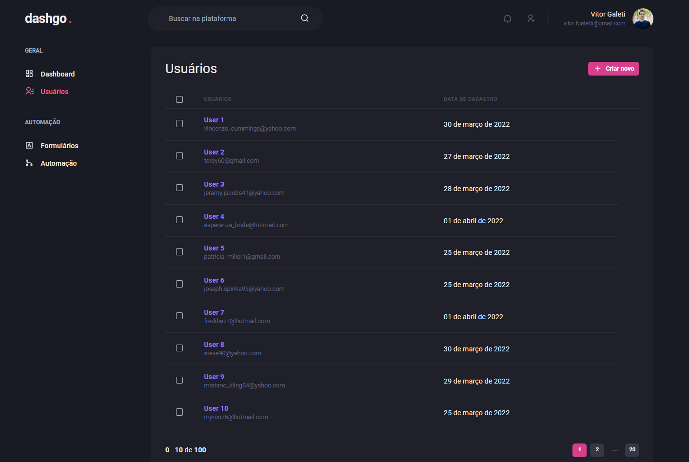
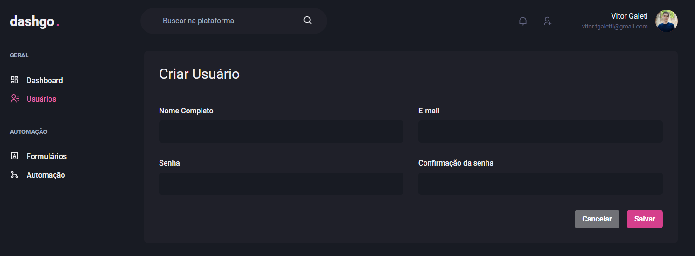

# Chapter IV - Construindo interfaces do futuro

<p align="center">
  
  
    
</p>

<br>

<p align="center">

</p>

<br>

<p align="center"><em>Confira o resultado do desafio em: <a href="https://dashgo-rocketseat-vitor.vercel.app/" target="_blank">dashgo-rocketseat-vitor.vercel.app</a></em></p>

## :computer: Sobre o projeto

<hr>

O projeto foi desenvolvido durante o capítulo IV do Ignite da Rocketseat. O objetivo era desenvolver um dashboard usando completamente o Chakra UI, também deixando a aplicação responsiva.

## Imagens

<div>

|                             Tela de Login                             |
| :-------------------------------------------------------------------: |
|  |

|                               Dashboard                               |
| :-------------------------------------------------------------------: |
|  |

|                             Usuários                             |
| :--------------------------------------------------------------: |
|  |

|                             Criar Usuário                              |
| :--------------------------------------------------------------------: |
|  |

</div>

## :rocket: Techs

<ul>
  <li> ReactJS </li>
  <li> TypeScript </li>
  <li> Next.js </li>
  <li> Chakra UI </li>
  <li> Axios </li>
  <li> React Hook Form </li>
  <li> React Query </li>
  <li> Mirage JS </li>
  <li> Yup </li>
</ul>

## Desenvolvimento

---

### Pré-requisitos

- Instalar [Node.js](https://nodejs.org)

- Instalar [Yarn](https://yarnpkg.com/)

### Clone o repositório

```bash
$ git clone https://github.com/vitorgaletti/ignite-reactjs-dashgo.git
```

### Executar Projeto

```bash
# Mudar para directório
$ cd ignite-reactjs-dashgo/
```

- Instalar dependências

```bash
$ yarn
```

- Execute

```bash
$ yarn dev
```

```bash
$ yarn build
```

- Executar scripts

|          Ação          |  Utilização  |
| :--------------------: | :----------: |
|   Iniciar o servidor   |  `yarn dev`  |
| Compilar para produção | `yarn build` |

Acesse <http://localhost:3000> para ver o resultado.
