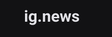
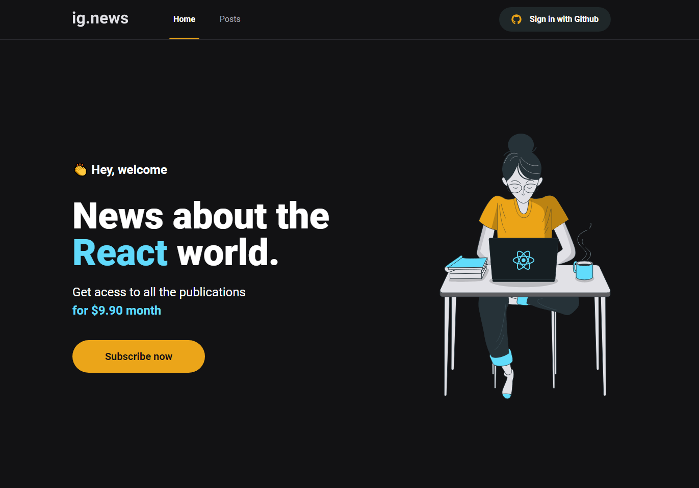
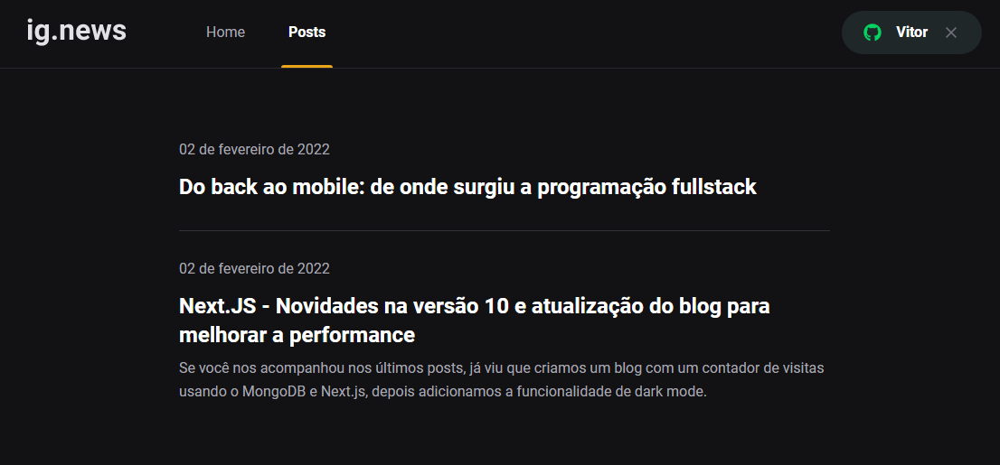

# Chapter III - Front-end JAMStack

<p align="center">


</p>

<p align="center">
     
</p>


<br>

<p align="center"><em>Confira o resultado do desafio em: <a href="https://ignews-rocketseat-vitor.vercel.app/" target="_blank">ignews-rocketseat-vitor.vercel.app</a></em></p>

## :computer: Sobre o projeto

<hr>

O projeto ig.news é um blog onde os usuários podem acessar diversos conteúdos sobre tecnologia de acordo com o status de sua assinatura.

- O blog possui um sistema de login com o Github, onde a autenticação é feita pelo NextAuth em conjunto com o Github Provider.

Para os usuários consumirem todo o conteúdo dos posts, é necessário realizar uma assinatura mensal. Caso o usuário não deseje optar pela assinatura, ele terá acesso limitado ao conteúdo das postagens.

- O blog possui um sistema integrado ao Stripe para que o usuário possa efetuar o pagamento da assinatura mensal. Logo após o pagamento, sua assinatura estará ativa e pronta para visualizar o conteúdo completo de todo o blog.

- Todos os dados necessários para se fazer verificações de assinaturas ou dados dos usuários, estão salvos no banco de dados FaunaDB.

- As postagens são feitas pelo painel do Prismic CMS e integradas diretamente pelo front.

Essa é uma aplicação Serverless, ou seja, todo o processo que dependeria de um backend foi integrado dentro do front e seguindo o padrão da JAMStack.

## Imagens

<div>
   
   
</div>

## :rocket: Techs

<ul>
  <li> ReactJS </li>
  <li> TypeScript </li>
  <li> Next.js </li>
  <li> Axios </li>
  <li> Sass </li>
  <li> Stripe </li>
  <li> FaunaDB </li>
  <li> Prismic </li>
</ul>

## Desenvolvimento

---

### Pré-requisitos

- Instalar [Node.js](https://nodejs.org)

- Instalar [Yarn](https://yarnpkg.com/)

### Clone o repositório

```bash
$ git@github.com:vitorgaletti/rocketseat-ignite-reactjs.git
```

### Executar Projeto

```bash
# Mudar para directório
$ cd 03-fundamentos-do-nextjs/
```

```bash
# Mudar para directório
$ cd ignews/
```

- Instalar dependências

```bash
$ yarn
```

```bash
# Crie um arquivo .env.local e configure as váriaveis de ambiente

# Stripe
STRIPE_API_KEY =
NEXT_PUBLIC_STRIPE_PUBLIC_KEY=
STRIPE_WEBHOOK_SECRET=
STRIPE_SUCESS_URL=
STRIPE_CANCEL_URL=

# Github
GITHUB_CLIENT_ID=
GITHUB_CLIENT_SECRET=

# FaunaDB
FAUNADB_KEY=

# Prismic CMS
PRISMIC_ENDPOINT=
PRISMIC_ACESS_TOKEN=
```

- Execute

```bash
$ yarn dev
```

```bash
$ yarn build
```

- Executar scripts

|          Ação          |  Utilização  |
| :--------------------: | :----------: |
|   Iniciar o servidor   |  `yarn dev`  |
| Compilar para produção | `yarn build` |

Acesse <http://localhost:3000> para ver o resultado.
